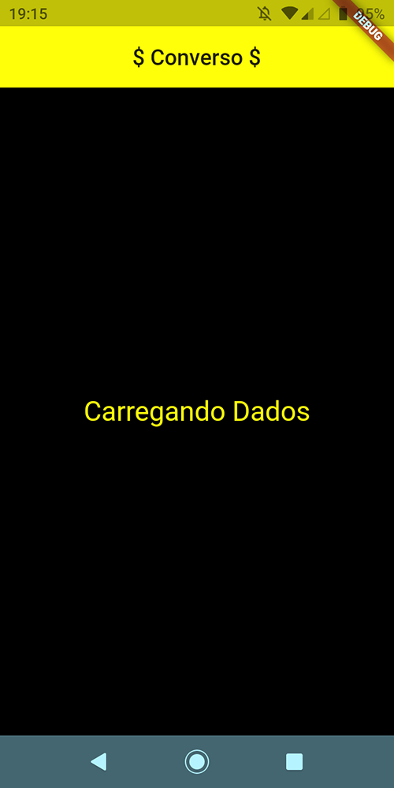
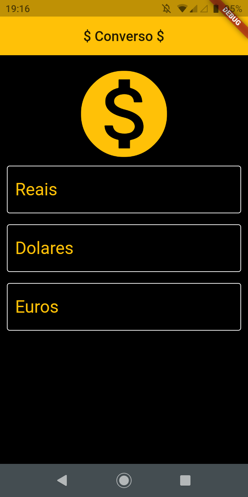
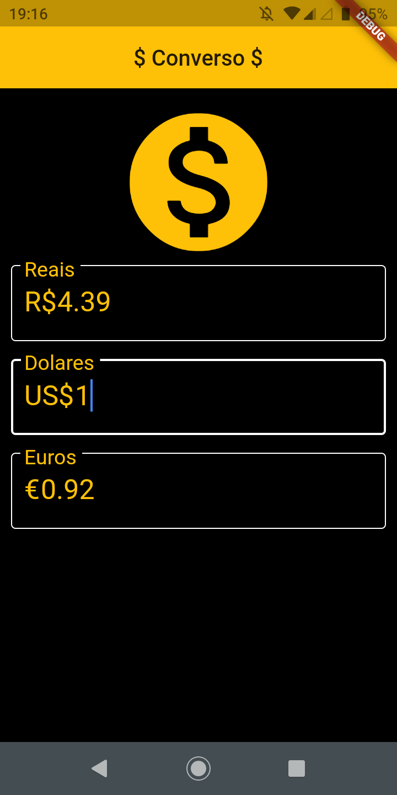

# converso_de_moeda

Este foi feito em Flutter.

## Sobre

Este app converte moedas em tempo real, utilizando a api do [hgbrasil](https://hgbrasil.com/)
Este app tem suporte para 3 moedas
- Real
- Euro
- Dolar

## Documentação online do Flutter
For help getting started with Flutter, view our
[online documentation](https://flutter.dev/docs), which offers tutorials,
samples, guidance on mobile development, and a full API reference.
